> **NOTE:** This README.md file should be placed at the **root of each of your repos directories.**
>
>Also, this file **must** use Markdown syntax, and provide project documentation as per below--otherwise, points **will** be deducted.
>

# Artificial Intelligence Application

## Keith Faunce

### Assignment 4 Requirements:

**Data Analysis & Visualization Steps**

1. Identify correlations
2. Import Seaborn
3. Graph correlations
4. Use simple linear regression
5. Create linear model
6. Plot regression line
7. Make predictions u. simple linear regression model

#### README.md file should include the following items:

* Screenshot(s) of Predictive Analysis running in jupyter lab
* Link to a4 .ipynb file [a4.ipynb](a4.ipynb "A4 jupyter notebook")

### Assignment Screenshots:

#### Screenshots of A4 running in jupyter lab 

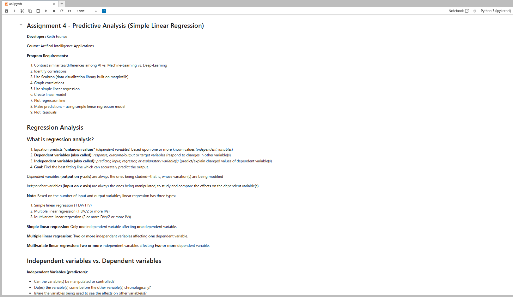

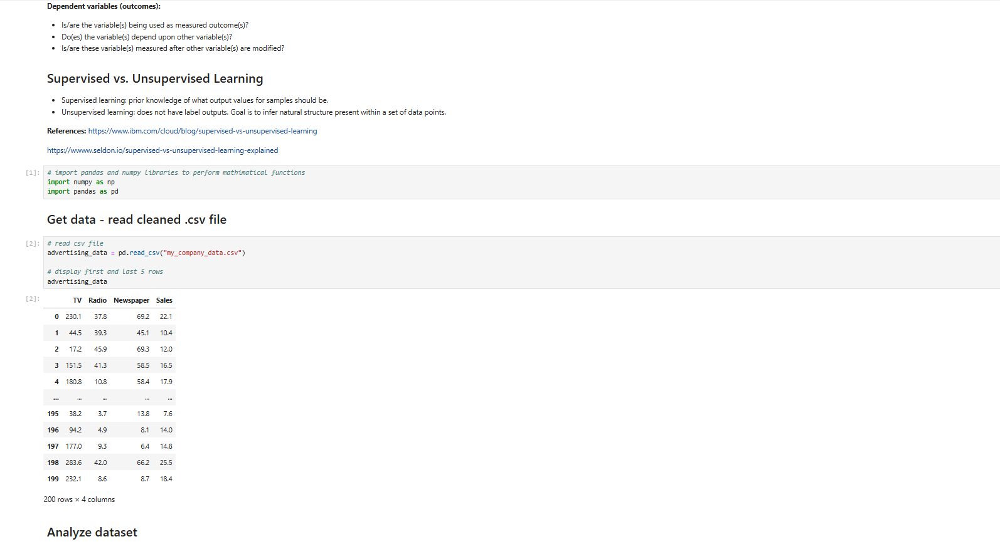

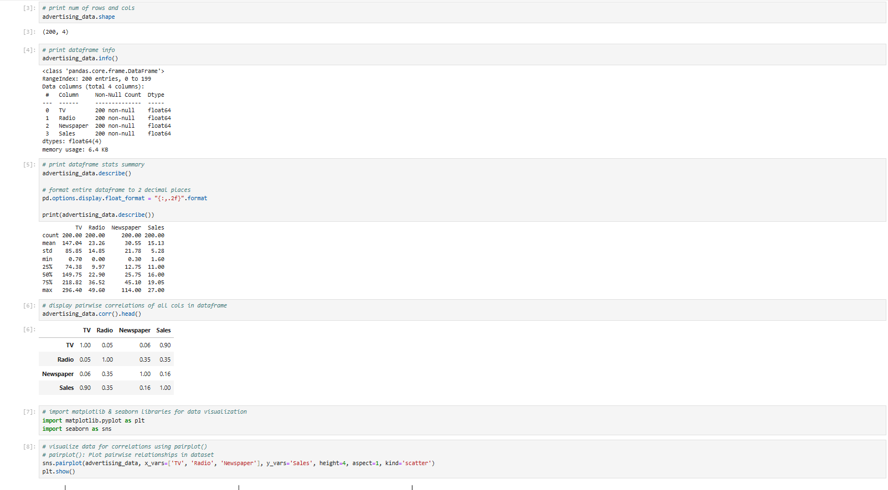

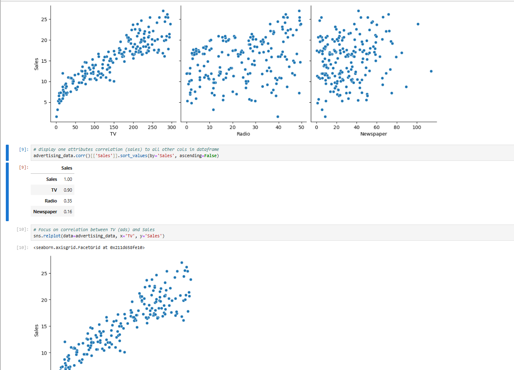

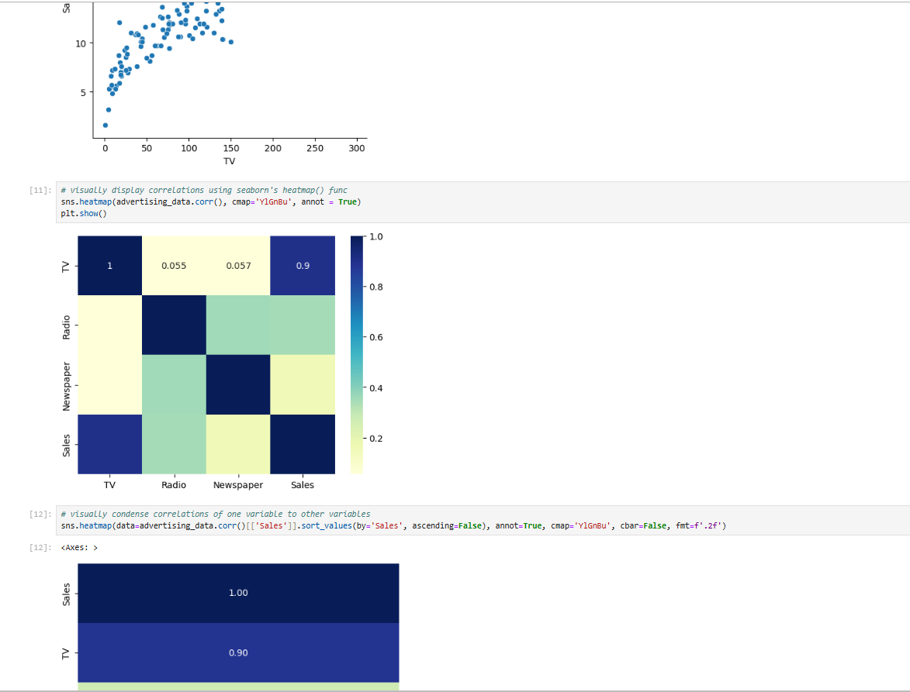

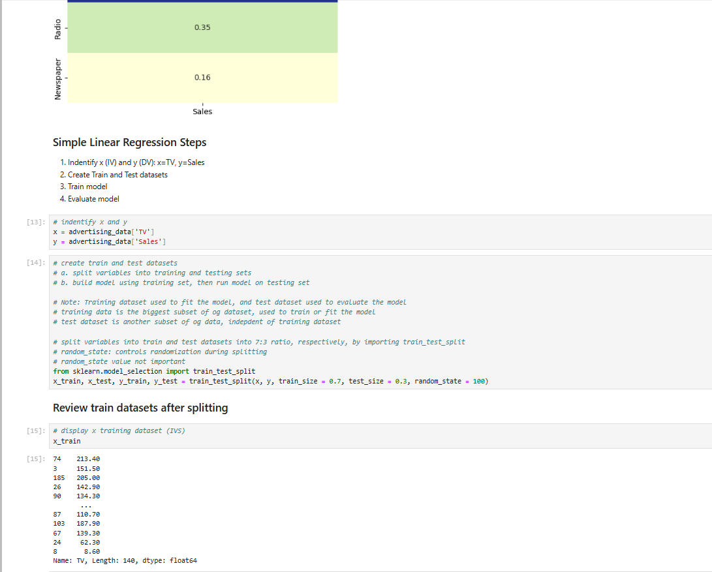

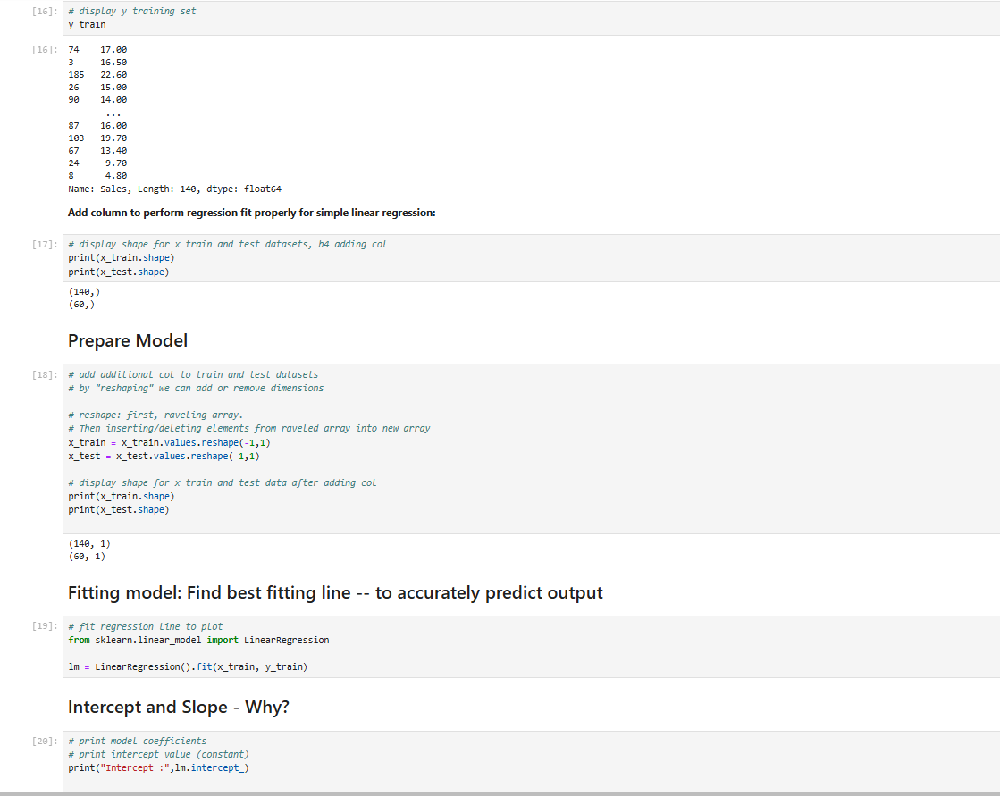

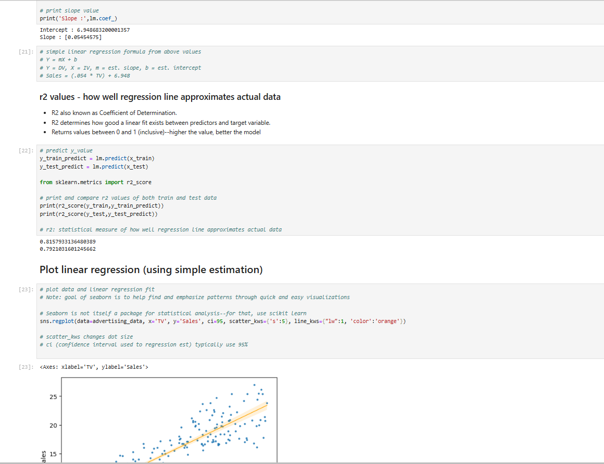

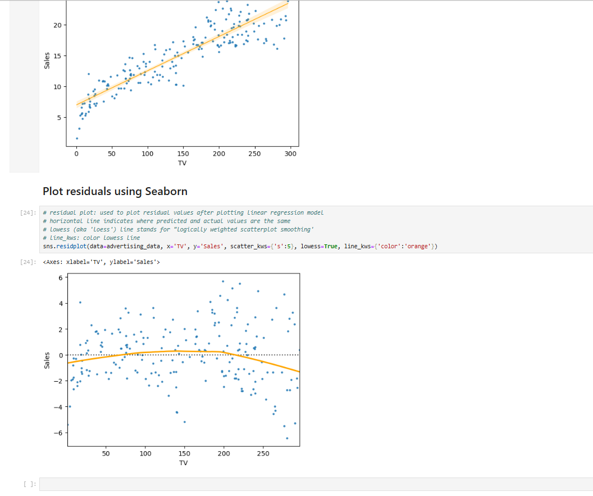

#### Skill Sets 4-6

Skill Set 10             | Skill Set 11             | Skill Set 12             |
------------------------ | ------------------------ | ------------------------ |
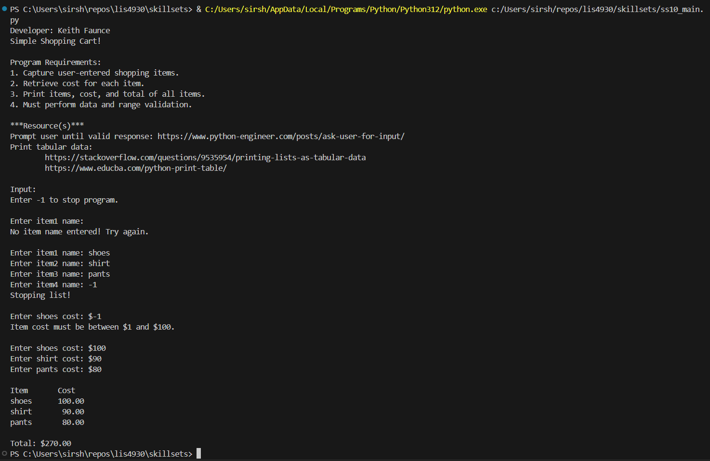 | 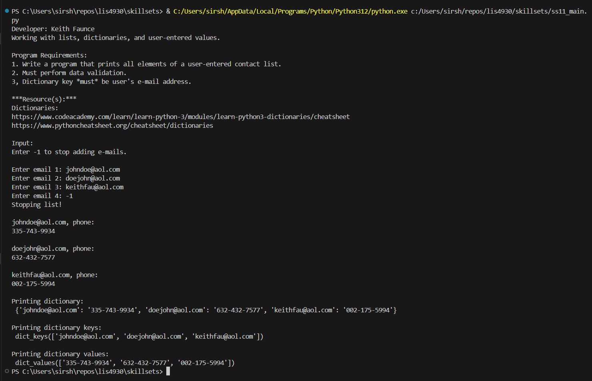 | 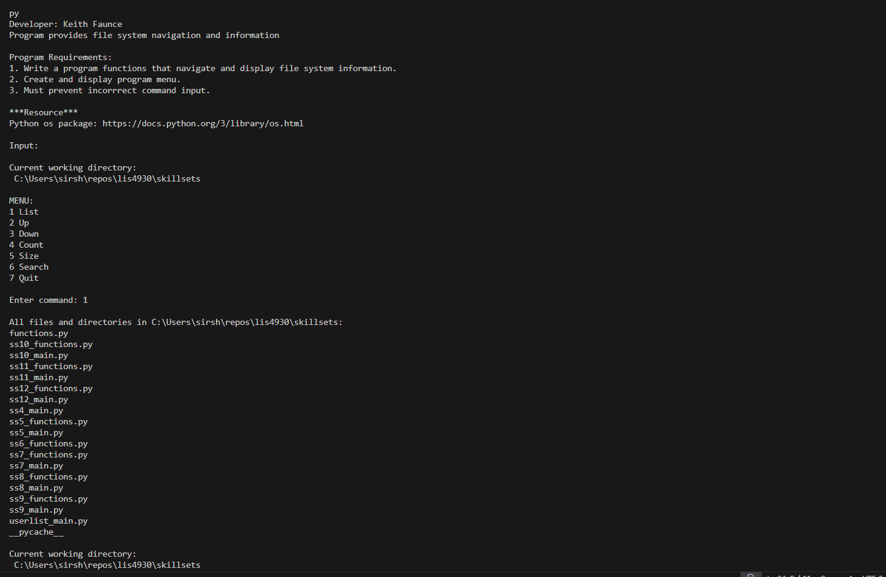 |
!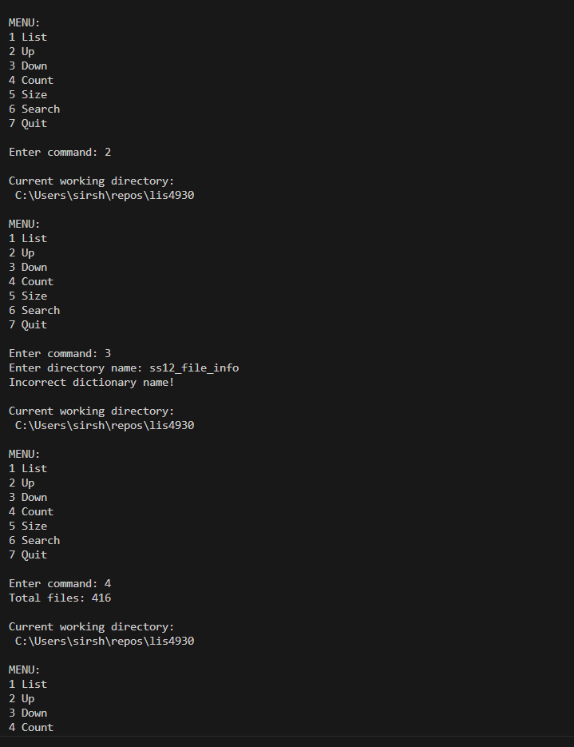 | 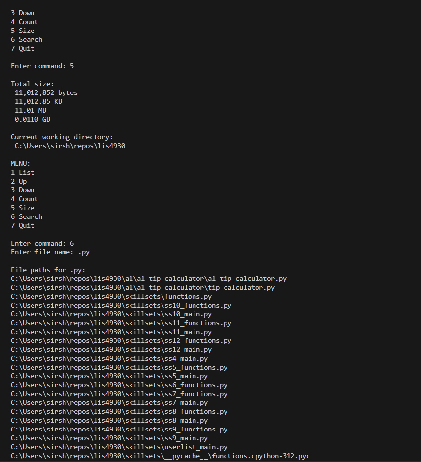 | 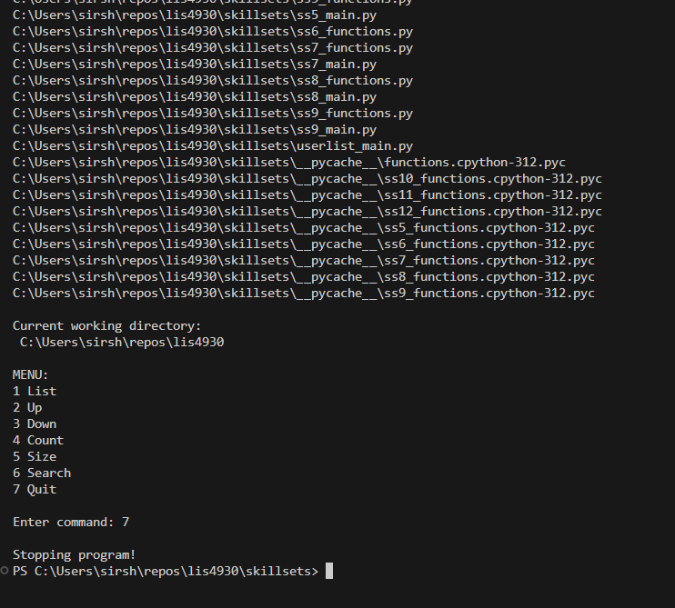 |
