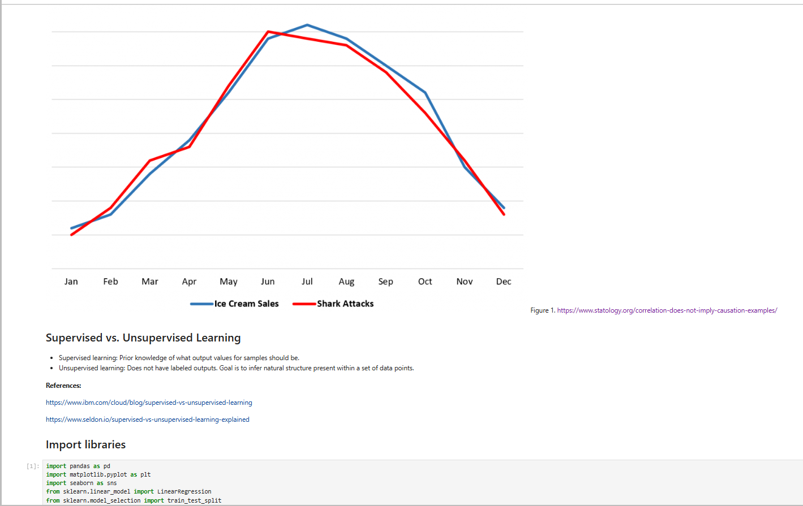
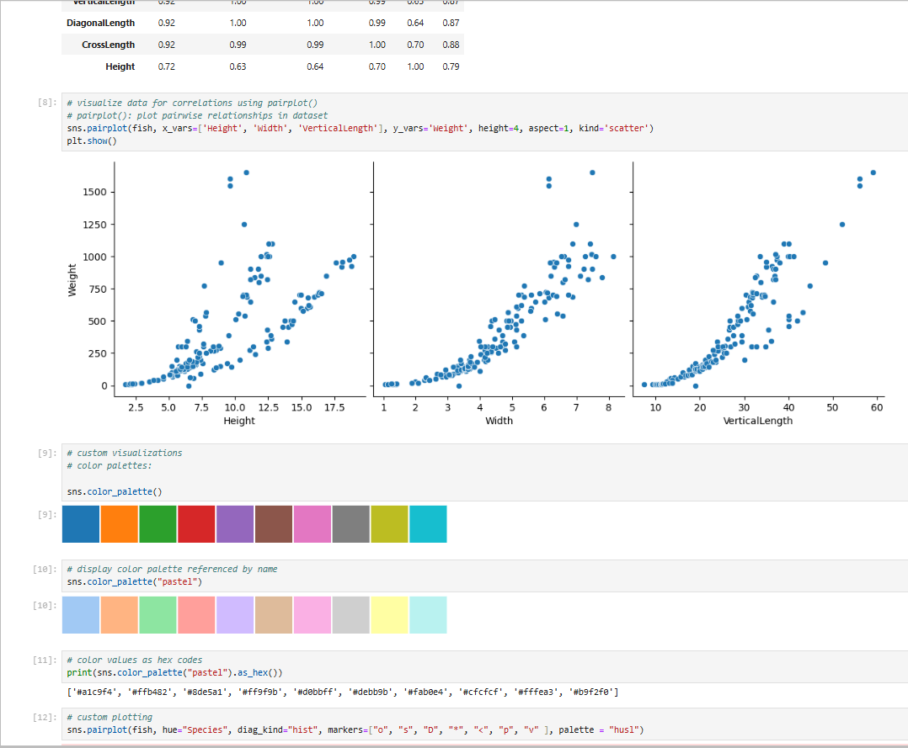

> **NOTE:** This README.md file should be placed at the **root of each of your repos directories.**
>
>Also, this file **must** use Markdown syntax, and provide project documentation as per below--otherwise, points **will** be deducted.
>

# Artificial Intelligence Application

## Keith Faunce

### Assignment 5 Requirements:

**Predicitive Analysis Steps**

1. Identify correlations
2. Utilize Seaborn
3. Use multiple linear regression
4. Create linear model/plot regression line
5. Make predictions - using simple linear regression model
6. Questions (Chs. 11, 12)

#### README.md file should include the following items:

* Screenshot(s) of Predictive Analysis running in jupyter lab
* Link to a5 .ipynb file [a5.ipynb](a5.ipynb "A5 jupyter notebook")
* Link to skillset 13 environment package list file [[testenv_packages.txt](conda_env/testenv_packages.txt)]
* Link to lis4930 environment package list file [a5_packages.txt](conda_env/a5_packages.txt)

### Assignment Screenshots:

#### Screenshots of A5 running in jupyter lab 

#### Enviornment Screenshot(s) (Has both)

#### Skill Set 14

   

   

  