> **NOTE:** This README.md file should be placed at the **root of each of your repos directories.**
>
>Also, this file **must** use Markdown syntax, and provide project documentation as per below--otherwise, points **will** be deducted.
>

# Artificial Intelligence Application

## Keith Faunce

### Project 1 Requirements

**Data Analysis & Visualization Steps**

1. Import necessary packages
2. Review data
3. Prepare the data
4. Filter data
5. Display data
6. Visualize data, graphs, tables
7. Create predicition analysis
8. Questions

#### README.md file should include the following items:

* Screenshot(s) of text_parser running in jupyter lab
* Link to p1 .ipynb file [p1.ipynb](p1.ipynb "P1 jupyter notebook")

### Assignment Screenshots:

#### Screenshots of A3 running in jupyter lab 

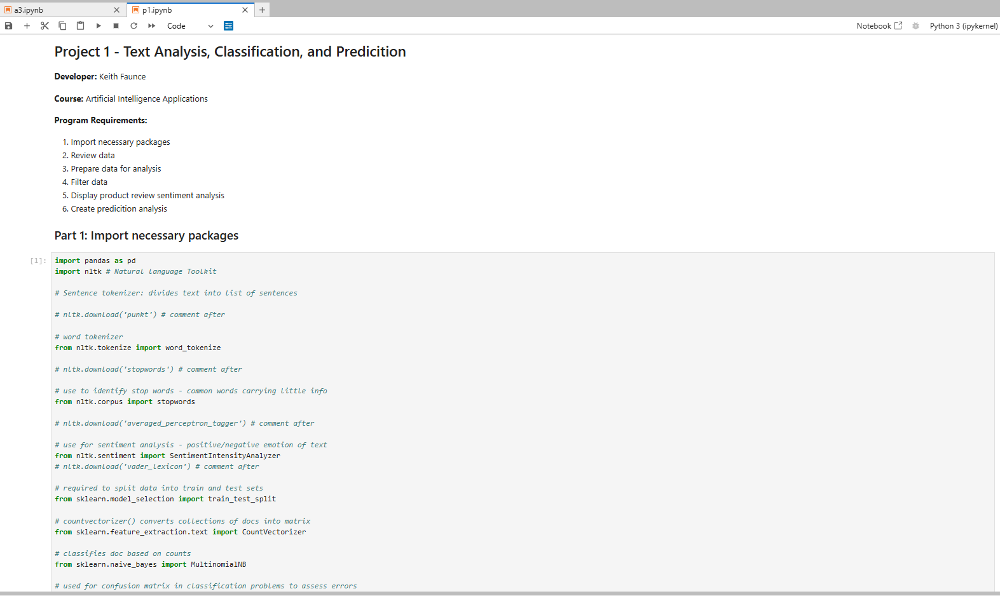

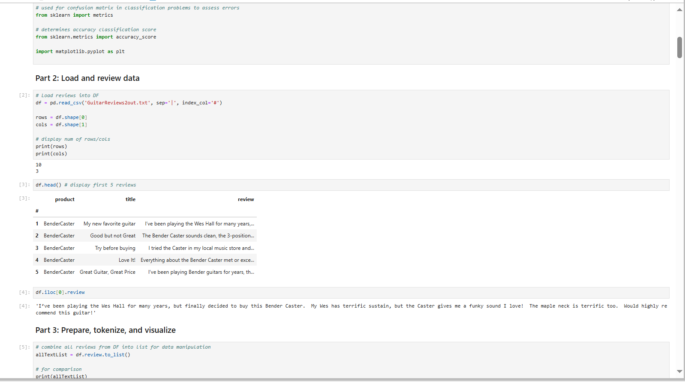

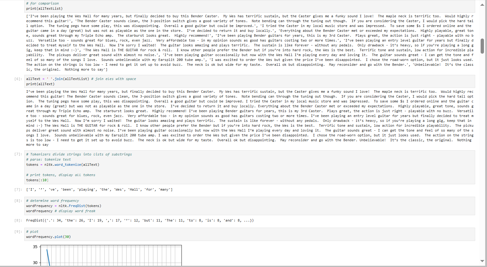

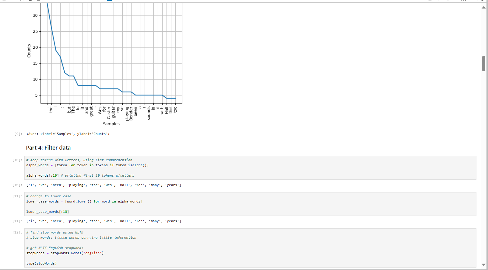

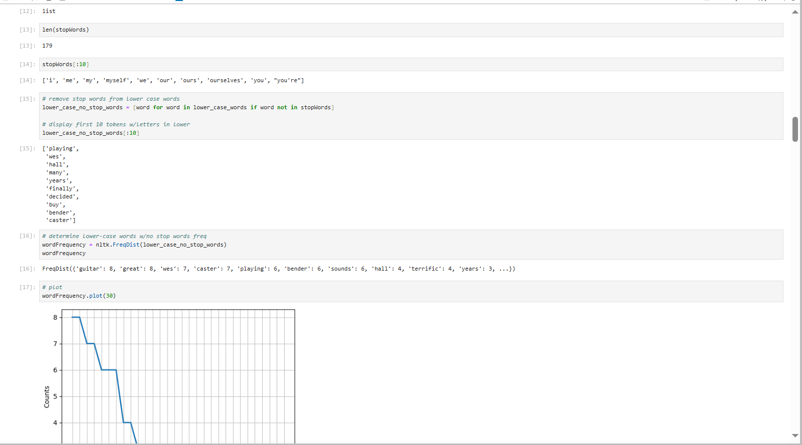

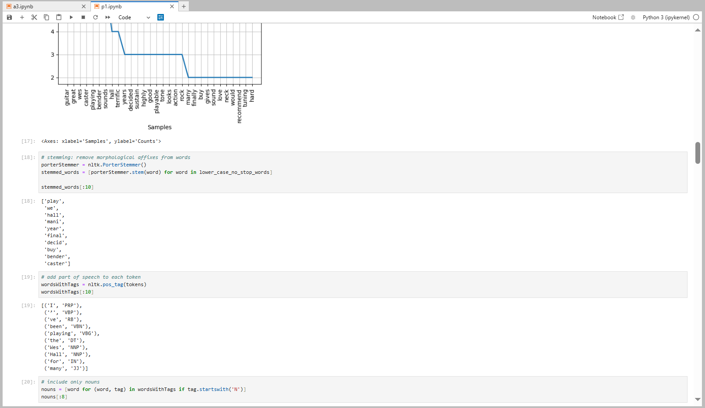

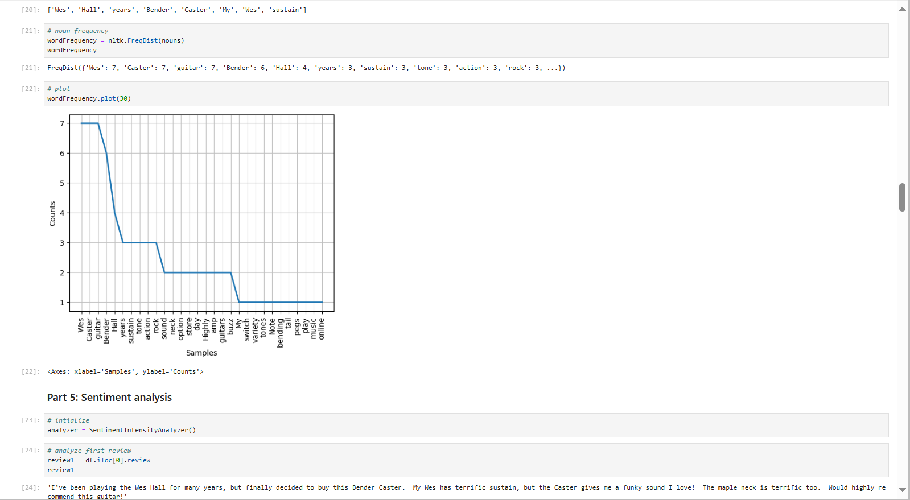

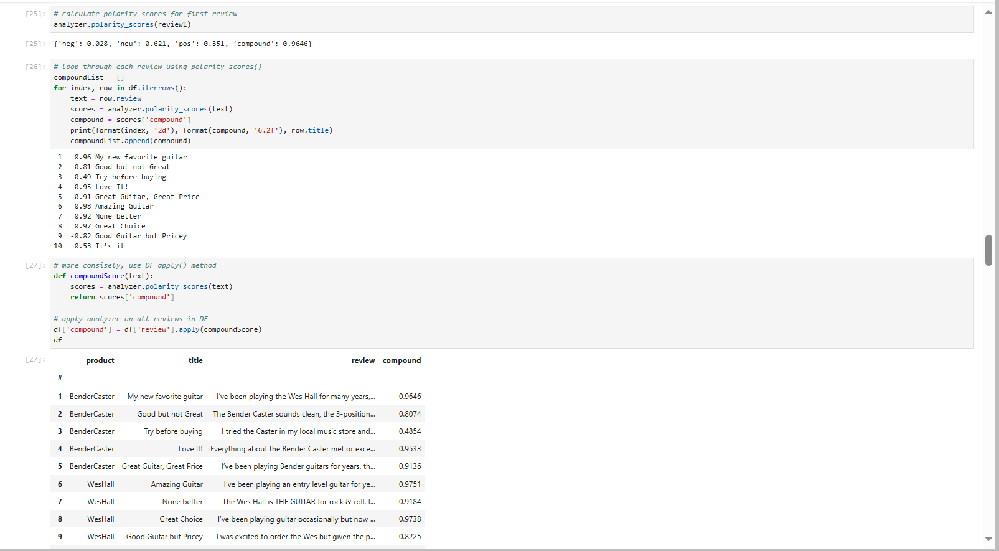

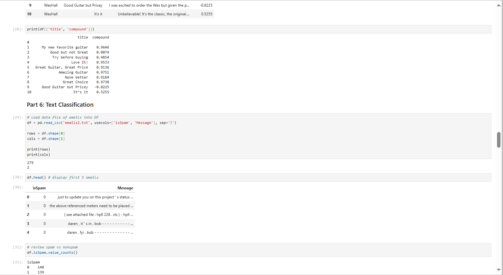

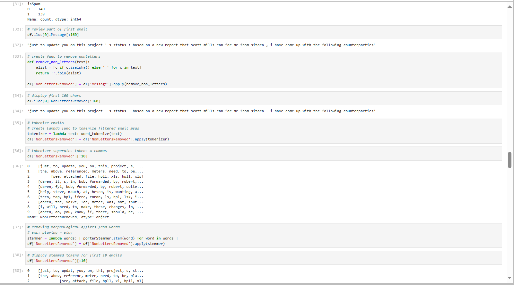

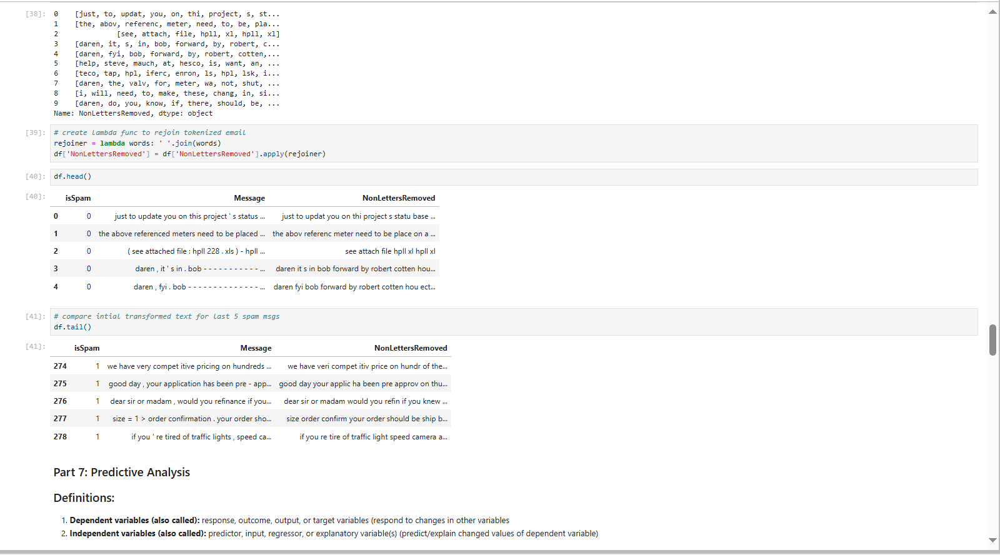

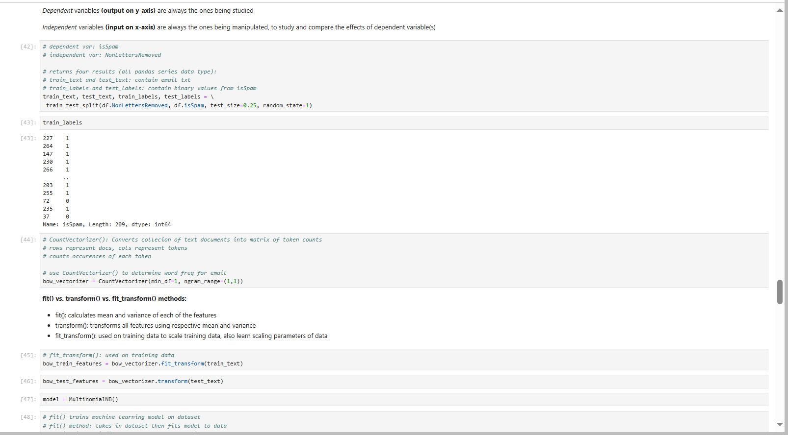

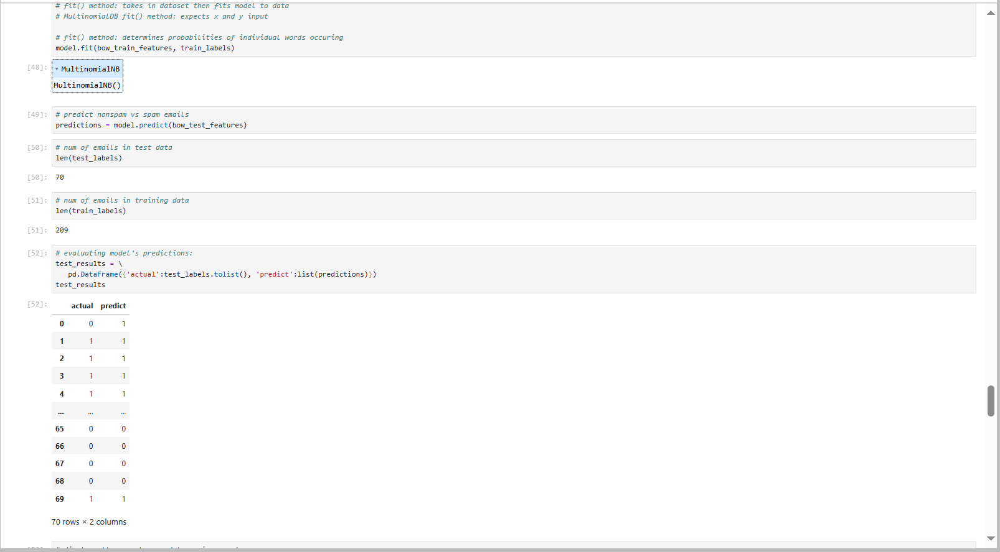

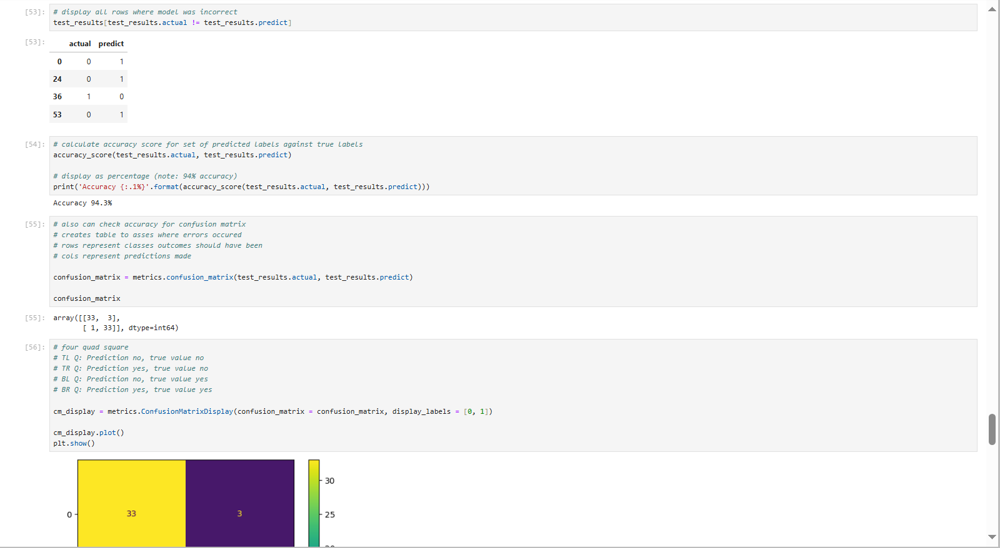

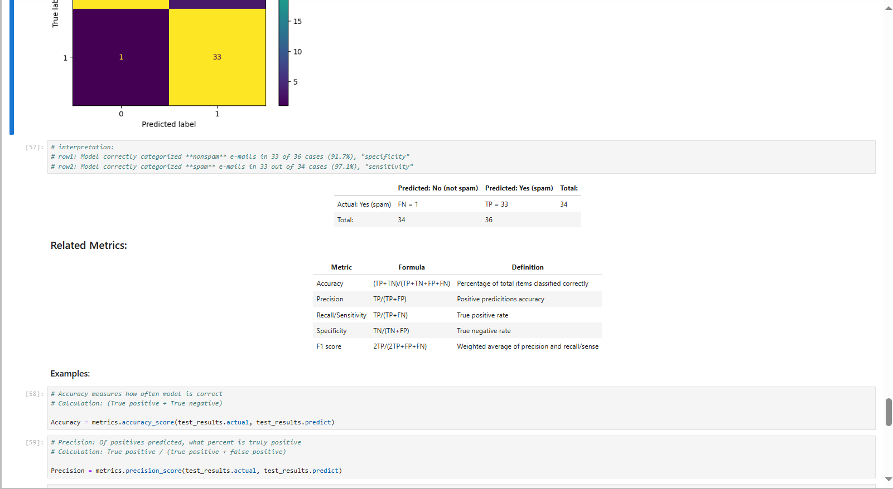

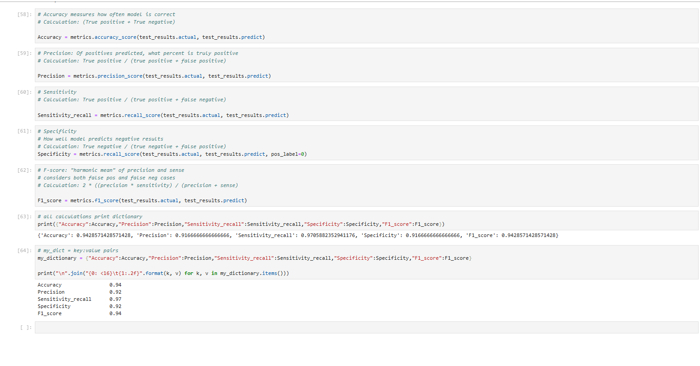

#### Skill Sets 7-9

Skill Set 7             | Skill Set 8             | Skill Set 9             |
----------------------- | ----------------------- | ----------------------- |
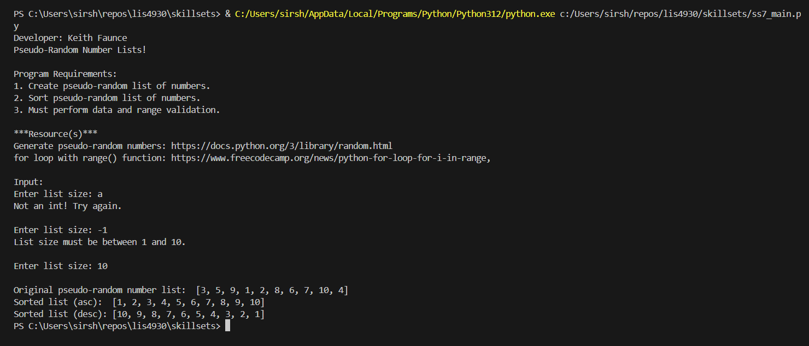 | 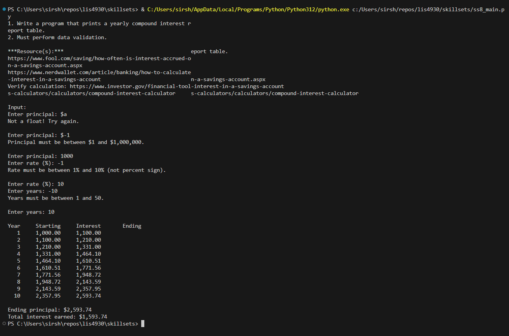 | 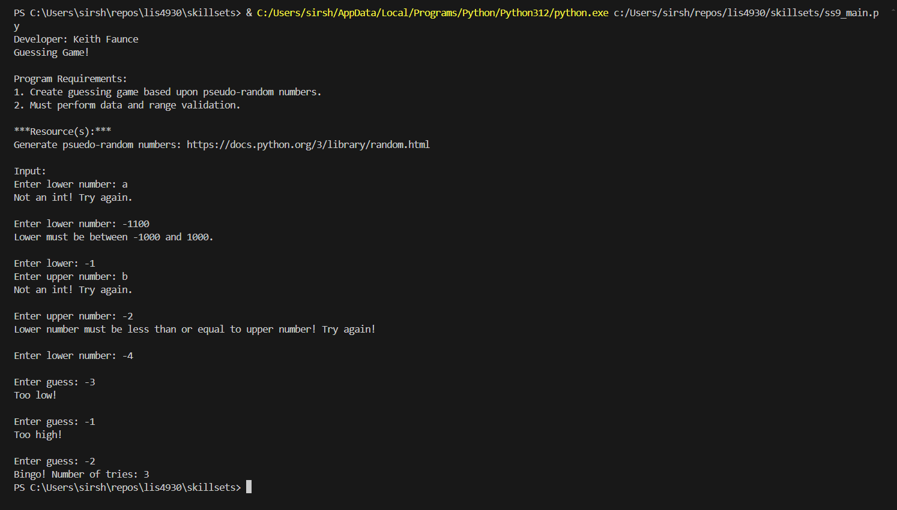 |
